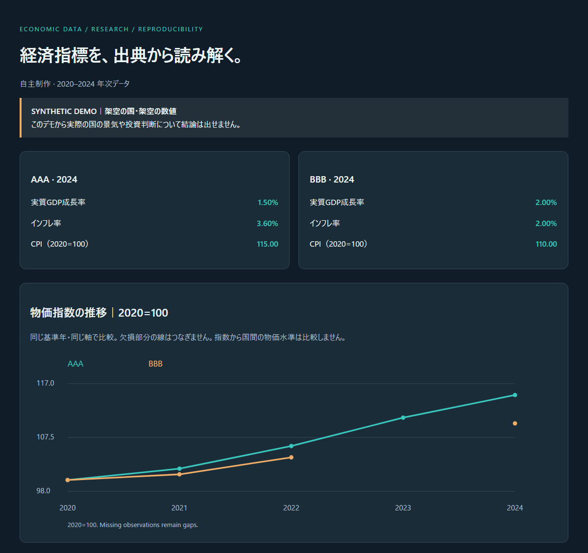

# 経済指標リサーチ・統計比較ラボ

**自主制作**。経済統計の整理、集計、記述統計、可視化、出典を追える分析資料の作成を示すサンプルです。資格・職歴・受託実績の主張はありません。

[デモレポート](demo/report.md) · [ダッシュボードHTML（ダウンロードして開く）](demo/report.html) · [CSV](demo/indicators.csv) · [記述統計CSV](demo/summary.csv) · [出典情報](demo/provenance.json)

## 成果物と対応する仕事

- 年次の実質GDP成長率・インフレ率・CPIを国・年・単位・状態（observed / null / absent）で整理するCSV（Excelで開けるUTF-8 BOM付き）。
- 国×指標ごとの記述統計CSV：観測数、平均、中央値、標本標準偏差、最小・最大とその年、CPIの年平均変化率（期間の両端が観測された場合のみ）。
- CPIを共通の基準年にそろえたSVGグラフ（欠損年は線をつながない）と、日本語の調査レポート（Markdown / HTML）。
- 欠損・未掲載・重複・不完全なページ取得を検査する品質レポート。公表インフレ率とCPIから計算した前年比の差（パーセントポイント）も確認用に出力し、どちらかで置き換えはしません。
- 入力スナップショット、取得URL・取得時刻、ファイルのSHA-256、方法・定義の参照資料を残す出典管理。

経済データの集計、統計資料の整理、経済リサーチ、市場調査の前段となるマクロ環境のデスクリサーチに使える制作例です。市場規模の推計、アンケート分析、因果推論、予測モデルは実装していません。

## 再現方法（標準ライブラリのみ / Python 3.10+）

リポジトリのルートで実行します。

~~~console
python projects/economic-indicator-research-lab/pipeline.py
python -m unittest discover -s projects/economic-indicator-research-lab/tests -v
~~~

既定ではネットワークを使わず、**架空の国AAA/BBB・架空の数値**の固定データ（`fixtures/demo.json`）から `demo/` を再生成します。実在国の景気を示すデータではありません。参照文献は方法・定義の資料であり、架空の数値の出典ではありません。テストは同じ入力から `demo/` の全ファイルがバイト単位で再現されることと、`provenance.json` のハッシュが `raw_snapshot.json` と一致することを確認します。

公開統計の取得は明示的な `--live` 指定と、`demo/` 以外の出力先が必要です（`demo/` は架空データ専用）。

~~~console
python projects/economic-indicator-research-lab/pipeline.py --live --countries JPN,USA --start 2020 --end 2024 --base-year 2020 --out economic-live-output
python projects/economic-indicator-research-lab/pipeline.py --fixture economic-live-output/raw_snapshot.json --out economic-live-rerender
~~~

World Bank Indicators API（v2, `source=2` = World Development Indicators）を使います。ISO3国コード（最大8か国）・年範囲（1960年以降、最長51年）・ページ数（最大20）・レスポンスサイズ（5MB）を制限し、APIエラー、ページ不足・重複・要求と異なるページ、件数不一致を検出して停止します。保存したスナップショットはネットワークなしで再集計できます。公開済みのデモとテストは固定データのみで、ライブ取得はこのリポジトリでは実行・検証していません。

## 集計で守ること

- null・未掲載・ゼロを区別し、ゼロ埋めや補間をしません。記述統計は観測値のみで計算し、観測数を併記します。
- 前年比は直前年が観測されているときだけ計算します。率の差はパーセントポイントで扱い、率の平均は単純平均であることを明記します。
- CPIの基準年は正の観測値がある年に限定し、指数から国間の絶対的な物価水準は比較しません。
- 公表インフレ率とCPIから計算した前年比は別系列として保存します。
- 説明的比較から因果関係・将来予測・投資判断を主張しません。

[参照資料と実装への適用](RESEARCH_APPLICATION.md)に、一次資料のURL、実装箇所、検証内容を記載しています。
